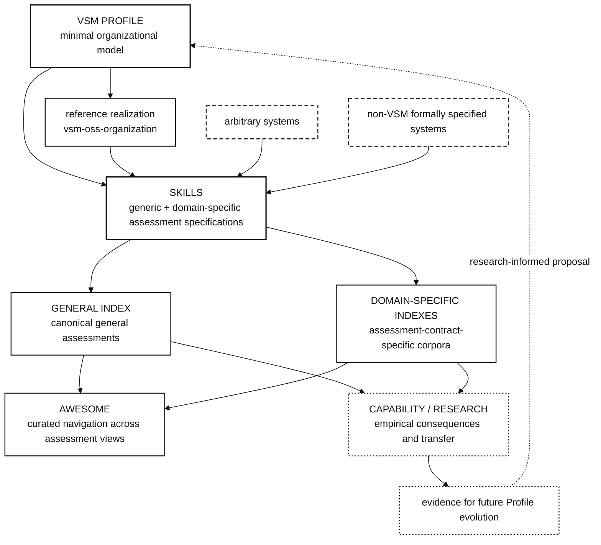

# Profile, assessment, and evidence architecture

This note is the focused assessment-architecture projection of [`ECOSYSTEM.md`](ECOSYSTEM.md). `ECOSYSTEM.md` remains authoritative for the cross-repository responsibility map; this document makes the Profile → assessment → corpus → research relationship explicit without duplicating repository-local semantics.

It does **not** redefine VSM semantics, assessment-state notation, canonical Index findings, or the current bounded organization. Repository-local owners remain authoritative for those facts.

## Architecture



The diagram is intentionally asymmetric:

- the **Profile** is a normative organizational model, not an assessment scorecard;
- **Skills** may assess a system that intentionally applies the Profile, an arbitrary harness in which VSM functions emerge, or a system formally specified under a non-VSM architecture;
- the **general Index** stores the canonical general assessment corpus;
- a **domain-specific index** is a fresh assessment system with its own assessment contract and corpus, not a filtered view of the general Index;
- **Awesome** may curate and route readers across both general and domain-specific assessment views without becoming a second source of truth;
- **Capability / Research** studies empirical consequences and may motivate future Profile changes, but does not redefine current Profile semantics.

## Profile boundary

The Profile owns the minimal organizational model used to describe VSM systems at a declared system boundary. It may be applied constructively or descriptively.

Constructive use:

```text
Profile
  ↓
intentional realization
  ↓
assessment
```

Descriptive use:

```text
arbitrary or differently specified system
  ↓
assessment
  ↓
observed VSM-function mapping
```

A system does not need to call itself VSM for an assessment to identify VSM-relevant functions. Conversely, merely using VSM terminology does not establish that a system satisfies the Profile.

Profile versioning remains independently meaningful. A Profile release records changes to the organizational model so downstream consumers, derived profiles, implementations, and assessment specifications can pin, inherit, compare, or migrate against an exact semantic revision. Profile versioning is therefore not owned by the general Index lifecycle.

## Skills boundary

`opensiro/vsm-harness-skills` owns assessment specifications and publication procedures that apply Profile semantics without redefining them.

The canonical generic assessment is one assessment specification, not the only possible one. Additional domain-specific or community assessment skills may impose their own:

- system-in-focus and admission boundary;
- evidence requirements;
- domain-specific capability requirements;
- permitted or required ownership arrangements;
- outputs and publication contracts.

Those requirements do not redefine S1-S5. If an assessment needs new VSM semantics, the semantic change belongs in the Profile first.

## General Index boundary

`opensiro/vsm-harness-index` is the canonical corpus for the **general OpenSiro VSM Harness assessment**. Its assessment links should resolve to artifacts produced under the general assessment contract owned by `vsm-harness-skills`.

The Index owns accepted instances, provenance, longitudinal history, and materialized general-corpus views. It does not own the meaning of Profile semantics or assessment-state notation.

Legacy Profile-driven reassessment coupling in Index operations is deprecated as an architectural authority boundary: a Profile version change may be relevant input, but the applicable assessment specification decides whether and how a concrete assessment corpus must migrate or be revalidated. Historical reassessment rounds remain valid provenance and are not rewritten.

## Domain-specific indexes

A domain-specific index is a separate assessment corpus produced under a domain-specific assessment specification. It may reuse:

- the same Profile;
- generic assessment evidence from the general Index;
- public observations from capability research;
- additional domain-specific evidence.

It may legitimately reach a different conclusion because the operating purpose, system boundary, evidence threshold, or autonomy requirement differs.

A domain-specific index is therefore not:

```text
GENERAL INDEX WHERE domain = X
```

It is:

```text
Profile
  + domain assessment specification
  + domain evidence
  ↓
domain-specific corpus
```

No domain-specific index is implied to exist merely because this architecture permits one.

## Reference realization

`opensiro/vsm-oss-organization` is an intentional public realization surface for applying the Profile to a bounded OSS organization. It may provide construction evidence, implementation feedback, and concrete failure modes for Profile evolution.

It does not gain authority to redefine the Profile by implementing it. Profile semantics remain owned by `opensiro/vsm-harness-profile`, and assessment semantics remain owned by the applicable skill in `opensiro/vsm-harness-skills`.

A useful release discipline for future material Profile changes is:

```text
semantic proposal
  ↓
constructive realization path
  ↓
assessment under an applicable skill
  ↓
reviewable evidence
  ↓
Profile release decision
```

This is a realizability discipline, not a requirement that one reference implementation uniquely determines the normative model.

## Research feedback

Research may discover that a particular organizational closure pattern correlates with capability, adaptation, self-reconfiguration, or another empirical property. Such findings are evidence for a future semantic proposal, not retroactive changes to the Profile currently used by frozen assessments.

The intended feedback loop is:

```text
Profile
  ↓
implementation / observed systems
  ↓
assessment
  ↓
Index / domain indexes
  ↓
Capability / Research
  ↓
future Profile proposal
```

Each step preserves its own provenance and source of truth.
